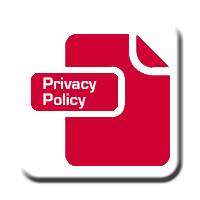

# What are a Code of Ethics?

	From a very young age, my mother instilled the Golden Rule upon me. To treat others as I would wish to be treated. Between being reminded daily that every person is dealing with their own inner demons and the many Ethics courses throughout High School and College, I feel as though I am a considerate person. One who looks at a given situation from not only my perspective, but from alternate perspectives as well as to empathize with their stance. Ethical issues are important to recognize in every field of study. On my path to becoming a computer scientist, I see the relevance of my field in many aspects of daily life. With that level of involvement comes the responsibility all those intricicies entails. Since our field of study impacts many lives, it is important to understand how our work might effect those lives. But we must not only understand the change but must strive to make that change a positive one. The ACM Code of Ethics and Professional Conduct and the Software Engineering Code of Ethics provides us with the practices necessary to reinforce our moral compass as we produce and as we conduct our research. 
 

## Protecting your Privacy

	
## Conclusion

