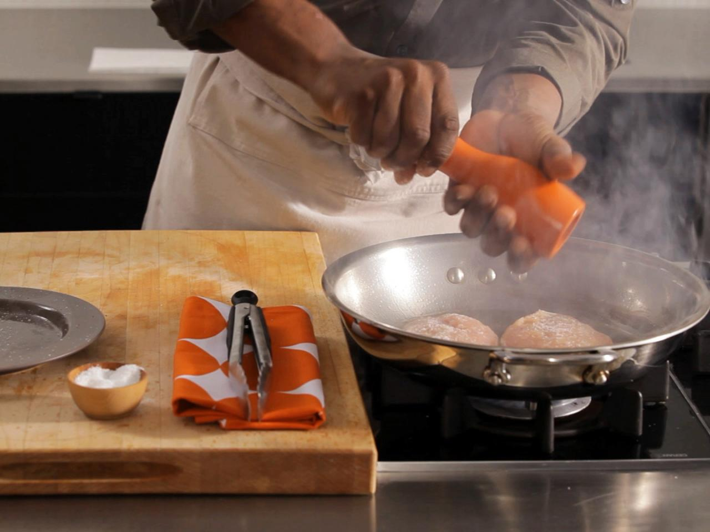

# Who Hates Dry Chicken?

I hate dry chicken. I hate eating it and I hate serving it. It is a very easy ingredient to overcook, as ensuring that the chicken reaches 165 degrees Fahrenheit is very important in regards to food safety. But let's not just isolate and shame chicken. Whether you use a grill, an oven, broiler, or stove, cooking chicken perfectly is possible for everyone. Cooking in general requires consistency, integrity, and attention to details. Luckily, we subscribe to the method of developing and sharing recipes to standardize cooking procedures and using the proper measurements of complimentary ingredients. By searching for the perfect recipe and following their instructions, the cook limits the variability of the intended final product. What will be left after the procedure reflects upon your own personal preference. Either you will find that the recipe was perfect for you, or it was missing some element in it, or it was just not for you. Once you find the perfect recipe for you however, you will have found your new standard method of preparation when it comes to those collections of ingredients. That recipe will be one of your solutions to creating a great home cooked meal. After you have gathered a collection of these recipes, you may have found that cooking chicken on the grill provides the best results, or that by baking the chicken, you have found your go-to method. It is when you have found this method that you are able expand your creativity to create variations of your favorite recipes.

## How I Cook Chicken

Let's take Chicken Breasts for example. When I want to prepare chicken with a salad, I look to end up with strips of chicken breast seasoned to provide a stark contrast to flavor of the dressing. Whether I use blackened seasoning, greek seasoning, or just salt and pepper, I cook the chicken in a saute pan with olive oil. Crispy, breaded chicken breasts go well in sandwiches, and whether I start them in the fryer or in a pan, I always finish them off in the oven. Experimenting with what works best for me with every meal is something I find joy in. In every way to cook something, there are benefits to that cooking method. Knowing how to smoke, or grill, or saute, or bake all provide unique flavors. To me, being a great cook is knowing when to use each of the cooking methods and building around a certain recipe.

