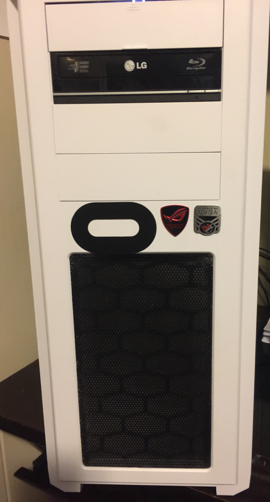
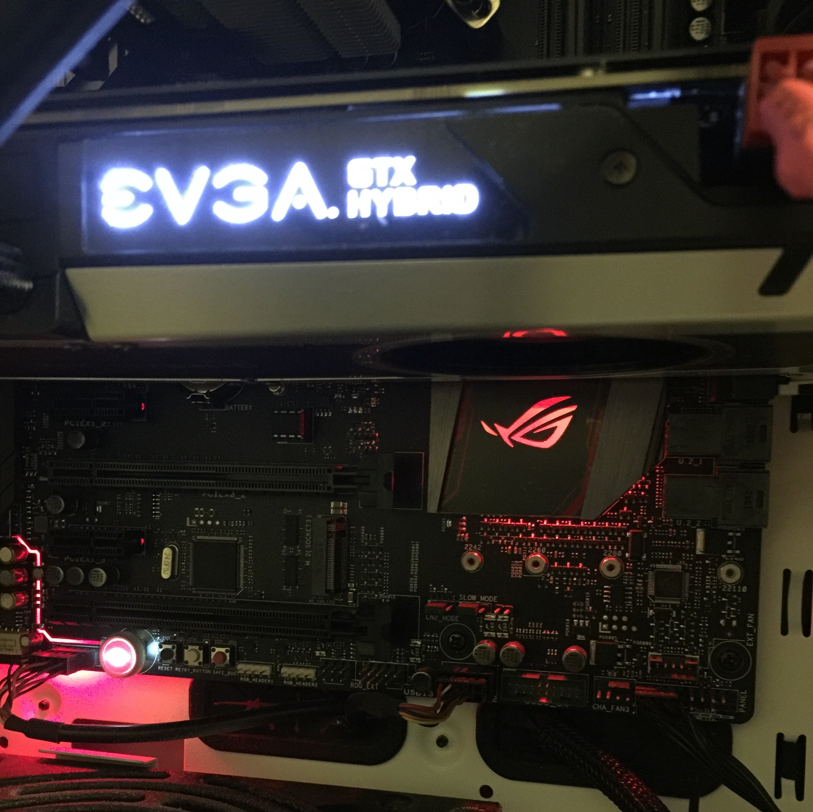

 

I built my last computer in 2009 and it was time for an upgrade. In the spring of 2016 I was able to purchase all the parts that would allow me to create my new system. My girlfriend showed interest in the process, so I suggested that she take on the responsibility herself. After a few viewings of YouTube tutorials, I deconstructed my old system to allow her to get familiar with the components. When she became comfortable enough, I talked her through some of the initial steps and then took a backseat as she built my (which is now our) new computer.

Specs:

Case: Phanteks Enthoo Pro Full Tower

MB: ASUS ROG Maximus VII Hero Alpha

Processor: Intel i7-6700k @4.00GHz

Video Card: NVIDIA GeForce GTX 980 Ti Hybrid

RAM: G.SKILL 32GB Ripjaws V

